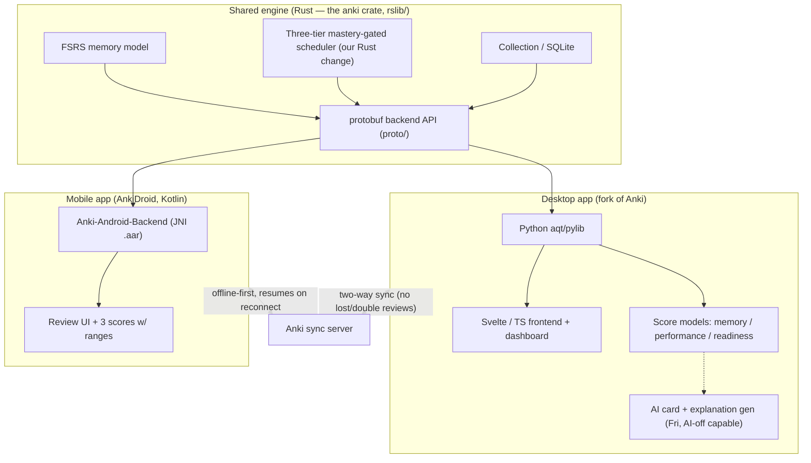
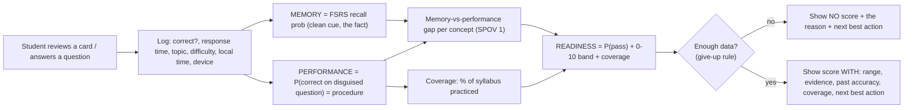
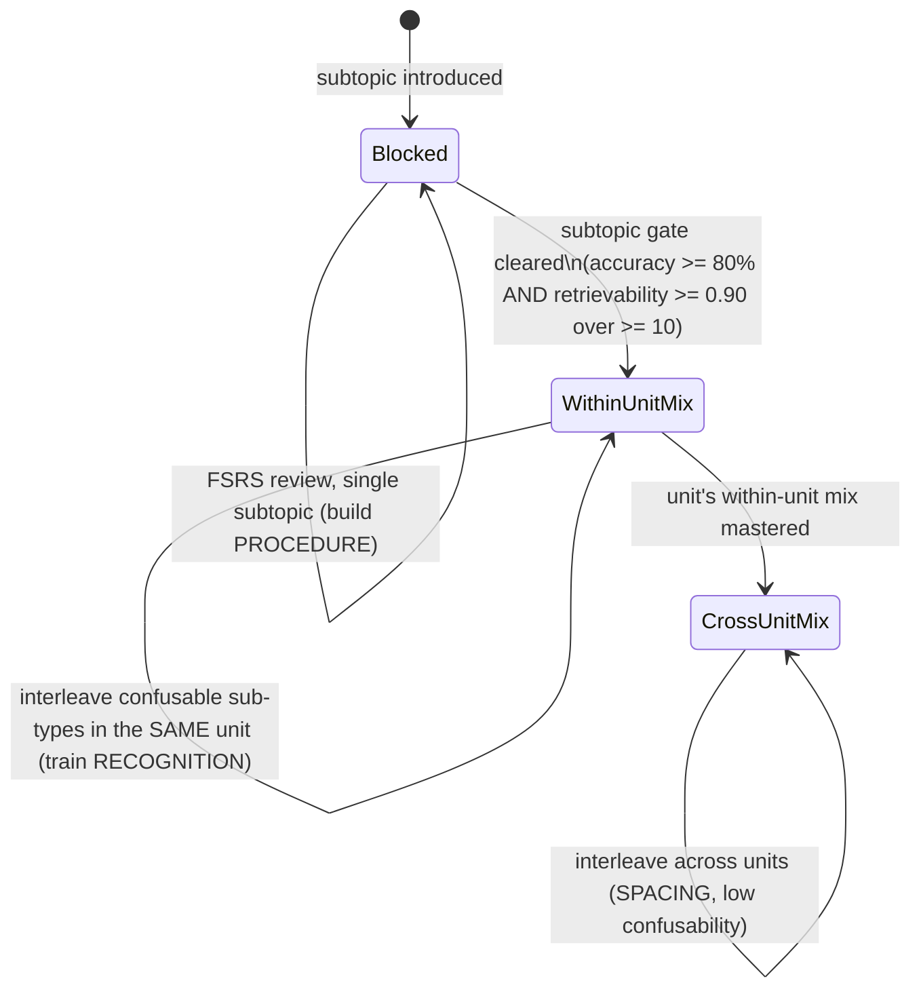

# PRD — Speedrun: a desktop + mobile study app for SOA Exam P

**Owner:** Katie He · **License:** AGPL-3.0-or-later (credit Anki; some Anki parts BSD-3-Clause)
**One line:** A fork of Anki that doesn't just help you _remember_ Exam P — it tells you, honestly, whether you'd _pass_.

> Read alongside `AGENTS.md` (the hard rules) and `SPEC_CHECKLIST.md` (the grade tracker).
> Where this PRD and the grading rubric disagree, the rubric wins.

---

## 1. Problem & purpose

Students preparing for SOA Exam P spend 150–300 hours and often still can't tell if they're ready. They lean on Coaching Actuaries (CA), whose Earned Level (0–10) and Mastery Score (0–100) make progress _feel_ measurable — but the number is a black box: you can't see the evidence behind it, what's missing, or how much to trust it.

**Purpose (from the BrainLift):** understand how to master Exam P material, and figure out what people actually struggle with while studying — then build a tool that is honest about readiness in a way CA is not.

The deeper problem is specific, not "people forget things." It's that **students mistake familiarity for transfer**: they can recall a formula and recognize a distribution, yet fail when the same idea is disguised inside a new word problem. Flashcards fix memory; Exam P demands _procedure_ — deploying the fact in a live setup. This app measures that gap instead of hiding it.

## 2. Users & jobs-to-be-done

- **Primary user:** a candidate studying for Exam P (self-study or alongside a course), reviewing at a desk and on their phone between classes.
- JTBD 1: _"Tell me what to study next and why"_ — the single highest-value action, with the reason shown.
- JTBD 2: _"Tell me if I'm actually ready,"_ with a range and honest uncertainty — not a flattering number.
- JTBD 3: _"Show me where I only think I know it"_ — high memory, low transfer.

## 3. The exam (state this up front in the README)

SOA Exam P is **not** one of the rubric's four example exams (MCAT/LSAT/GMAT/USMLE). Be explicit about its real scale so the score model never looks invented:

- Computer-based, 3 hours, multiple choice A–E, including **5 unscored pilot questions**.
- **Scored 0–10; 0–5 = fail, 6–10 = pass.** Unofficial instant pass/fail at the center; official scaled score ~8 weeks later.
- Section weights (May 2026 syllabus): **General Probability 23–30% · Univariate Random Variables 44–50% · Multivariate Random Variables 23–30%.**
- Calculus (series, integration, differentiability) is assumed — so we treat raw _computation_ ability as given and focus the app on recognition + procedure.
- Pass rate ~43% historically; Jan 2026: 49.2% pass / 57.2% effective pass.

**Readiness output for P** = P(pass ≥ 6) with a confidence band + a projected 0–10 band + % of syllabus covered. Never a single bare number.

## 4. Product principles (the honesty rule)

The app answers three _different_ questions and never blends them:

1. **Memory** — can the student recall this fact now? (Anki's FSRS.)
2. **Performance** — can they answer a _new_ exam-style question that uses it?
3. **Readiness** — what would they score today, and how sure are we?

**No readiness score may appear unless it also shows:** the evidence behind it, what data is missing, how accurate past guesses were, a range (not a point), and the single best next thing to study. Below the data threshold the app shows **nothing** (the give-up rule). A confident number with none of that behind it is a guess in a nice font — and an automatic fail.

---

## 5. Tech stack (confirmed)

Fork Anki's real, current stack and share its engine across both apps.

- **Engine (shared):** Anki's **Rust** backend — the `anki` crate in `rslib/`. FSRS (memory) already lives here. Our scheduler change goes here.
- **Rust ↔ Python bridge:** backend methods are defined in **protobuf** (`proto/`) and code-generated into Rust + Python. Our new scheduler/mastery call is exposed as a new protobuf message and invoked from `pylib`.
- **Desktop app:** the Rust backend + **Python** (`pylib`/`aqt`) + a **TypeScript/Svelte** frontend. Dashboard + score UI live here. Build & launch with `./run`; installer via `tools/build-installer`.
- **Mobile app:** **AnkiDroid** (Kotlin) consuming the **same Rust engine** through the `Anki-Android-Backend` JNI bridge (produces an `.aar`). Android is the pragmatic path this week; iOS (Rust C FFI, the AnkiMobile approach) is a stretch.
- **Sync:** Anki's built-in sync (self-hostable Rust sync server) reused for two-way sync; conflict rule documented.
- **Score models (Python, desktop):** memory = FSRS; performance = a small calibrated classifier (e.g. logistic regression / gradient-boosted trees) that predicts correctness on _disguised, parameterized_ exam-style questions from mastery, difficulty, response time, coverage; readiness = a written-down mapping from performance + coverage to P(pass) + a 0–10 band, with a bootstrap range.
- **AI (Friday):** retrieval-grounded card/explanation generation from **named sources**, a verifier against a gold set, and a keyword/vector baseline to beat. Fails closed when off/offline.
- **Tests/evals:** `pytest` (Python), `cargo test` (Rust), a seeded held-out split, a leakage-scan script wired to CI, the 3-build ablation harness, and `make bench`.

### System architecture

### Review → measurement flow (where the three scores come from)

---

## 6. Spiky POVs → features (the heart of the build)

Your brainlift has **two** Spiky POVs. Build the first; the second is a bonus you are explicitly not building yet.

### SPOV 1 — "Procedure and recognition are the two skills the exam punishes, and they must be built in that order" → the **three-tier, mastery-gated scheduler** _(THE spine: it is your Rust change AND your ablated study feature)_

Break "answer an exam question" into **recognition** (which topic/distribution is this?), **procedure** (recall the fact _and_ deploy it — set up the random variable, handle conditioning, choose the integral/sum), and **computation** (arithmetic/calculus). On this exam you never recall a formula in a vacuum, so recall and application are one skill — **procedure** — which has a memory component FSRS _can_ track and an application component it _can't_; the gap between them is the signal the app most needs to surface. The exam assumes computation, so it isn't the bottleneck. **Procedure is the bottleneck; recognition is what interleaving trains** — and you can't discriminate between procedures you can't yet run, so procedure must come first.

That yields three tiers, each with its own mastery gate:

1. **Block subtopics** → build _procedure_ in isolation (one cognitive cost at a time).
2. **Interleave _within_ a unit** → train _recognition_, because within a unit the sub-types are exactly what students confuse (binomial vs. Poisson vs. geometric; does it need conditioning; MGF vs. raw moment). High confusability ⇒ discriminative contrast pays off. **This tier is what the ablation removes.**
3. **Interleave _across_ units** → the three units (general probability / univariate / multivariate) are easy to tell apart, so this tier buys _spacing_, not discrimination.

- **Multi-level gates (not one switch):** a subtopic joins its unit's within-unit pool only after clearing its gate; a unit joins the cross-unit pool only after its within-unit mix is mastered. Gate, pre-registered before looking at results: **blocked accuracy ≥ 80% AND FSRS retrievability ≥ 0.90 over ≥ 10 problems.** Because questions are **parameterized** (numbers regenerate each review), clearing a gate means repeated correct _execution_, not a memorized answer.
- **Why this is the spine:** it IS the required Rust change (topic-aware scheduling + a mastery query in `rslib`), and it IS the one study feature you ablate. Evidence: Mielicki & Wiley (2022) found only learners with substantial prior knowledge benefited from interleaved probability word problems, and a rigid hybrid didn't beat pure interleaving — so gate on competence, per topic, and mix hardest where items confuse.

### The three scores connect to SPOV 1 (they're required by the spec; SPOV 1 defines what "performance" must measure)

The three separate scores are a Speedrun rubric requirement, NOT a separate Spiky POV. But SPOV 1 tells you _why_ performance ≠ memory and _what_ the performance score should capture:

- **Memory** = recall of the fact on a clean cue (FSRS).
- **Performance** = getting a _disguised, parameterized_ question right = **procedure** (recognition + recall + setup), computation assumed. This is the "application component FSRS can't see."
- The dashboard surfaces **high-memory / low-performance** concepts (knows the formula, can't deploy it) as the #1 place to study. The paraphrase test (§9, 7d) checks this gap is real and not just memory in disguise.

### SPOV 2 — "Chronotype should be a measured variable, not a productivity tip" → chronotype-aware timing _(BONUS — do NOT build this project)_

Time of day isn't universally good or bad; it depends on chronotype, sleep, and task type. Effortful, controlled work (timed practice, active recall) favors a person's **peak** window; first-time **encoding** favors the **afternoon** for most people; **transfer** is a recall-insight hybrid whose best time must be **learned per user**. The right feature reserves high-alertness windows for precision tasks (timed transfer, mixed practice, high-weight weak topics) and does maintenance in weaker windows — the scheduler choosing not just _what_ but _when_.

- **Scope:** your brainlift marks this "don't implement for this project yet," and the rubric wants exactly **one** ablated feature (SPOV 1). Keep chronotype in the spec's §13 "feature ideas"; build only if the core is solid, and if you ever ablate it, do so as a _separate_ experiment.

---

## 7. Scope

### Today (MVP for mentor/classmate feedback ≈ the Wednesday core, NO AI)

Realistically, "test the MVP with mentors today" means getting the **concept + earliest running build** in front of people, not the graded three-score AI system. Aim to demo:

- Your Anki fork **building and launching** (`./run`).
- **One tiny Rust change visible end-to-end** (even a trivial backend value surfaced in Python) to prove the hardest plumbing works — then start the real scheduler.
- A **review loop on a small Exam P deck** (a handful of cards across the 3 units).
- A **dashboard stub** that already shows the honesty-rule layout and the **give-up / "not enough data yet"** state.
- The **Spiky-POV→feature map** above, to get feedback (recommend committing to SPOV 1).

### This week

- **Wed:** core on both screens (desktop + phone review the same deck), Rust change with tests, memory model with range + give-up rule, installer.
- **Fri:** AI card/explanation gen with traceable sources + eval + baseline; two-way sync; phone shows the three scores.
- **Sun:** calibration, performance model, score mapping, the 3-build ablation, packaged installers, documented conflict handling, honest write-up.

---

## 8. The Rust change (spine) — the three-tier mastery-gated scheduler

Implement in the shared `anki` crate (illustratively `rslib/src/scheduler/…`; confirm paths against the current tree). Because the engine is shared, it ships to the phone too — verify on the AnkiDroid build. You need two pieces: the **mastery query** (per-subtopic/unit gate state + which pool a card belongs to) and the **ordering logic** (which tier's pool to draw from). Expose both via a new protobuf message called from Python.

Required with the change: a new **protobuf** message called from Python; **≥ 3 Rust unit tests** (tier transitions, the gate condition, and pool ordering) + **1 Python-calling test**; **undo works**, **no corruption**; a one-page `docs/rust-change.md` on why this belongs in Rust; `docs/upstream-touched.md` listing files touched + merge risk. Must be fast enough to power the dashboard on 50k cards.

**Status (built):** the mastery model, RPCs, and tier ordering exist, and the ordering is now wired into the **live** new-card queue (`build_queues`) behind an opt-in, default-off `speedrunMasteryScheduler` flag (read-only, so undo/integrity are untouched; off by default so the ablation's plain-Anki baseline is unchanged). `GetMasteryState` also returns an **importance-weighted mastery rollup** and a **"what to study next"** ranking; the study map renders topics as **importance-sized bubbles** (size = exam weight, colour = measured mastery).

## 9. The three models & the give-up rule

- **Memory (Step 1, required):** FSRS. Prove it's calibrated on held-back reviews (calibration chart + Brier/log loss).
- **Performance (Step 2, required):** predict correctness on held-back, _disguised_ exam-style questions from topic mastery, difficulty, response time, coverage. Per SPOV 1 this is _procedure_ — the application component FSRS can't see — so it must diverge from memory where transfer is weak.
- **Readiness (Step 3, required):** map performance + coverage → **P(pass)** + a projected **0–10 band** + a range. Write the method down. Coverage gates it.
- **Give-up rule (assertion + test):** below threshold (**e.g. ≥ 200 graded reviews AND ≥ 50% coverage**) return an explicit `NoScore { reason }`; the UI shows the reason, never a number. A deck skipping a high-weight section can't read "ready."
- Represent every score as a struct with required fields (`point, low, high, coverage_pct, confidence, updated_at, reasons[], next_best_action`) so a bare number can't be emitted.
- The full method for all three signals is written down in **`docs/score-models.md`** (memory = FSRS + held-out calibration via `make calibration`; performance = a calibrated classifier over a seeded held-out split of disguised items; readiness = the coverage-gated P(pass) mapping). A reusable, unit-tested calibration library (`pylib/anki/speedrun/calibration.py`: Brier, log loss, ECE, reliability bins) enforces the give-up rule on calibration itself. Until the performance model is calibrated, readiness stays `NoScore` — no invented number.

## 10. Study feature + ablation (section 8 of the spec)

Feature under test: the **within-unit interleaving tier** of the scheduler. Pre-registered hypothesis: _"After a subtopic is mastered, interleaving it against confusable sub-types **within its unit** — before any cross-unit mixing — raises accuracy on new, confusable within-unit transfer questions, at equal study time."_ Three builds, same learners, same questions, same time budget:

1. **full three-tier scheduler** (block → within-unit interleave → cross-unit interleave),
2. **within-unit interleaving removed** — a mastered subtopic drops straight into a global mixed pool,
3. **plain unmodified Anki.**

Main metric stated ahead: accuracy on held-out SOA sample questions, especially confusable sub-types. If build 1 doesn't beat build 2 there, report the null — it's a real result and scores well.

## 11. AI features + traceability (Friday)

Card + explanation generation grounded in **named sources** (SOA syllabus; Ross, _A First Course in Probability_; Hassett/Stewart/Milovanovic, _Probability for Risk Management_). Each output stores its source ref. Verify against a **gold set of ≥ 50** before students see it (report correct / wrong / bad-teaching; cutoff pre-set). Beat a keyword/vector baseline. Explanations follow the Mancinelli style: setup → triggered concept → the trap. Treat source files as untrusted (prompt-injection defense). Everything must degrade gracefully with AI off.

## 12. Sync design

Reuse Anki's Rust sync. Two-way, offline-first, no lost/double reviews (challenge 7b). Documented, deterministic conflict rule for the same card reviewed on both devices offline. Zero corruption on crash.

## 13. Data model — topic map & coverage (challenge 7c)

Encode the official Exam P outline as the topic tree (the 3 units and their subtopics — this tree is also what the scheduler's tiers gate on). Tag every card/question with a unit, subtopic, and difficulty, and make questions **parameterized** so numbers regenerate each review. The dashboard shows **% of the syllabus covered**; readiness abstains below the coverage line. Coverage, memory, and performance are shown separately (the CA critique: don't collapse everything into one opaque number).

## 14. Testing & evals (maps to challenges 7a–7h)

Held-out split with a fixed seed; leakage scan wired to CI (7e); paraphrase test (7d); AI card check (7f); crash + offline (7g); `make bench` on 50k cards (7h). See `SPEC_CHECKLIST.md` §6 and the `testing-evals` rule.

## 15. Speed & reliability targets (section 10)

Button ack p95 < 50 ms; next card p95 < 100 ms; dashboard load p95 < 1 s / refresh < 500 ms; sync < 5 s; cold start < 5 s desktop / < 4 s phone; stated memory cap on 50k cards; nothing freezes > 100 ms; zero corruption in the crash test. Report p50 / p95 / worst.

## 16. Experts / sources to draw on (from the BrainLift)

SOA (source of truth for the syllabus/scale) · Coaching Actuaries / Dave Kester (product inspiration + the black-box critique to beat) · The Infinite Actuary (curriculum shape) · Mancinelli Math Lab (explanation style) · Sheldon Ross and Hassett/Stewart/Milovanovic (write our _own_ concept explanations, don't copy prep companies) · Wieth & Zacks and chronotype/circadian researchers (SPOV 2, bonus).

## 17. Milestones & proof

See `SPEC_CHECKLIST.md` §§3–5. Every deadline needs **proof, not a promise**: commit hashes, clean-build + clean-install recordings, test output, eval numbers, sync recordings, calibration charts.

## 18. Today's plan (your four tasks)

1. **Run Anki locally.** Clone your fork (path with no spaces) → install Rustup + N2 (`tools/install-n2`) → `./run`. In parallel, get the Android side compiling: clone `Anki-Android` and `Anki-Android-Backend` into the same folder, build the `.aar`, run AnkiDroid on an emulator. _(Getting both builds green is the real day-one win — features come after.)_
2. **Confirm this PRD.** Adjust the give-up threshold, the gate numbers, and the readiness output if you disagree; lock the exam facts and the tech stack.
3. **Spiky POVs → features.** Commit to **SPOV 1 (the three-tier scheduler)** as your Rust change + ablated feature. Note the three-score split is **spec-required**, with SPOV 1 defining what _performance_ must measure. Park **SPOV 2 (chronotype)** as a bonus you won't build this project.
4. **Test the MVP with mentors + classmates.** Show the running fork, the review loop, the honesty-rule dashboard stub (incl. the "not enough data yet" state), and the SPOV→feature map. Ask specifically: _is the within-unit interleaving tier the right thing to bet the ablation on, and is the readiness/honesty framing clear?_

## 19. Out of scope / risks

- **Out of scope:** a RAG retrieval pipeline (this repo is direct context, not a retrieval DB); copying CA's paid question bank; chronotype (SPOV 2); iOS unless the core is done.
- **Risks:** the mobile build is the classic day-one time sink — do it today, not Thursday; the Rust build + protobuf wiring is the second. Don't let the agent quietly ship a JS scheduler (caps at 50%), collapse the three tiers into a single blocked→mixed toggle (that erases the within-unit tier you're ablating), or emit a bare readiness number (auto-fail).

## 20. Definition of done

Both apps install and run on a clean device with AI off and still give a score; a real Rust engine change (the three-tier mastery-gated scheduler) with tests; three separate scores with ranges and a working give-up rule; two-way sync with a documented conflict rule; the within-unit-interleaving ablation run fairly with results (including nulls); every AI output traceable and beating a baseline; the leakage scan clean; and the full hand-in in `SPEC_CHECKLIST.md` §9.
